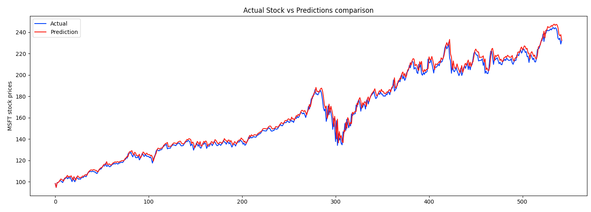

# Stock Price Prediction
This is an experimental project to use Long Short Term Memory (LSTM) networks for the stock price prediction. I borrowed a lot of idea from this article: https://medium.com/analytics-vidhya/long-short-term-memory-networks-lstm-in-tensorflow-e986dac5cf27.



## Create virtual env
```
python3 -m venv env
```

## Activate virtual env
```
source env/bin/activate
```

## Install required modules
```
pip3 install -r requirements.txt
```

## How to generate training data?
```
python3 generate_training_data.py --symbol MSFT --out train_data.txt 
```

## How to train?
```
python3 train.py --filepath train_data.txt
```

## How to predict?
```
python3 predict.py --symbol MSFT
```
